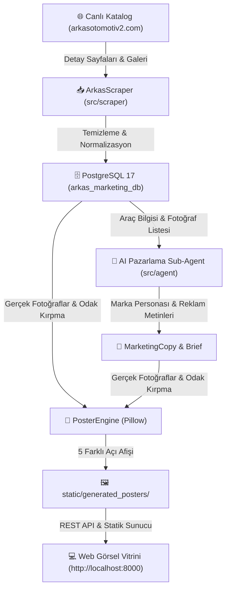

# Arkas 2. El Pazarlama AI - Canlı Katalog, Gerçek Araç Fotoğrafları ve Çoklu Açı Afiş Motoru

**Tarih:** 17 Ağustos 2026  
**Kapsam:** Canlı Katalog URL Güncellemesi (`https://www.arkasotomotiv2.com`), Çoklu Galeri Fotoğrafı Çekimi, Veritabanı Sıfırlama ve Akıllı Odaklı Çoklu Açı Afiş Render Motoru.

---

## 1. Yapılan Temel İyileştirmeler ve Çözülen Sorunlar

1. **Doğru Canlı Kaynak Bağlantısı:**
   - Önceki statik/yedek veri kaynağı yerine `.env` dosyasındaki `SCRAPER_BASE_URL=https://www.arkasotomotiv2.com` aktif edildi.
   - Doğrudan `https://www.arkasotomotiv2.com/Araclar/Index/1` katalog ve `Araclar/Goster/{id}` detay sayfaları taranmaktadır.

2. **Orijinal Araç Fotoğraf Galerisi Çekimi:**
   - Arkas Otomotiv 2 altyapısındaki `panel/public/resimler/{id}-{img_id}.jpg` formatındaki **1.35 MB yüksek çözünürlüklü orijinal araç fotoğrafları** çekilmektedir.
   - Her araç için 3 ila 19 adet arasındaki tüm dış, ön, far, arka ve iç mekan fotoğrafları `vehicles.image_urls` JSON dizisine kaydedilmektedir.

3. **Veritabanı Sıfırlama (`--reset-db`):**
   - Hatalı veya eski fotoğrafların tümü temizlendi.
   - PostgreSQL 17 üzerindeki tüm tablolar (`vehicles`, `creative_briefs`, `marketing_copies`, `posters`) sıfırlandı ve canlı verilerle sıfırdan dolduruldu.

4. **Akıllı Çoklu Açı Afiş Render Motoru (`poster_engine.py`):**
   - Tek bir araç için aynı renk, aynı marka-model ve aynı ton korunarak **5 farklı pazarlama açısı** üretilmektedir:
     - 🌟 **Ana Dış Görünüm (`instagram_post`):** Aracın tam ön 3/4 açılı ana vitrin görseli.
     - 💡 **Ön Far & Izgara Detayı (`detail_headlight`):** Ön LED far, ızgara ve tasarım detaylarına odaklanan yakın plan (macro) açısı.
     - 🏎️ **Arka Çamurluk & Dinamik Profil (`rear_profile`):** Arka çamurluk, jantlar ve aerodinamik yan hatları vurgulayan dinamik açı.
     - 🛋️ **İç Mekan & Kokpit (`interior_cockpit`):** Kokpit, direksiyon veya kabin yaşam alanı açısı.
     - 📱 **16:9 Web & Sosyal Medya Bannerı (`banner`):** 1200x630 piksel yatay format.

5. **Web Vitrininde Açı Değiştirici Sekmeler:**
   - Modal penceresine dinamik açı sekmeleri (`🌟 Ana Dış Açı`, `💡 Ön Far & Izgara`, `🏎️ Arka Dinamik Profil`, `🛋️ İç Mekan & Kokpit`, `📱 16:9 Banner`) eklendi.
   - Kullanıcı her açıyı anında görüntüleyebilir ve yüksek çözünürlüklü olarak indirebilir.

---

## 2. Mimari Veri Akışı



---

## 3. Veritabanı ve DBeaver Durumu

* **Host:** `localhost` | **Port:** `5432` | **DB:** `arkas_marketing_db`
* **Tablolar:**
  * `vehicles`: Canlı araç kayıtları ve `image_urls` galerisi.
  * `creative_briefs`: Marka arketip ve hedef kitle briefleri.
  * `marketing_copies`: Safe ve Bold reklam metinleri, kancalar ve story akışları.
  * `posters`: Her araç için üretilen 5 farklı açıdaki afiş kayıtları (`poster_type`, `file_url`, `badge_text`).

---

## 4. Kullanım Komutları

```bash
# Sanal ortamı aktif et
source .venv/bin/activate

# 1. Sıfırdan temizleyip canlı verileri çekmek ve çoklu açı afişlerini üretmek için:
python main.py --reset-db --limit 15

# 2. Yalnızca web vitrinini başlatmak için:
python main.py --web-only

# 3. Yalnızca scraper çalıştırmak için:
python main.py --scrape-only

# 4. Yalnızca afişleri yeniden üretmek için:
python main.py --generate-only
```
