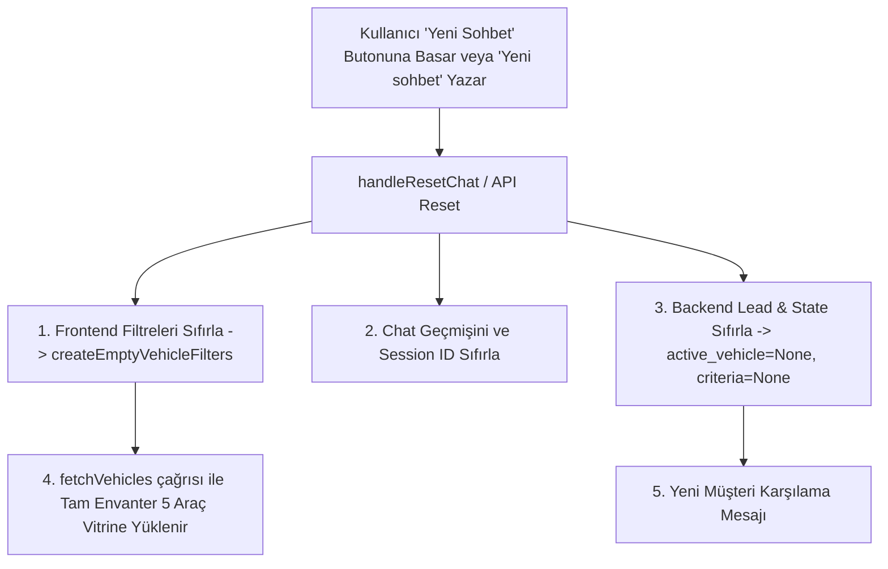

# Arkas Spoticar AI Satış Danışmanı — Chat Reset & Filtre Senkronizasyonu Mimarisi

**Tarih:** 19 Ağustos 2026  
**Durum:** Çözüldü & Test Edildi (63/63 Birim & Regresyon Testi Geçti, Next.js Build Başarılı)

---

## 1. Root Cause (Kök Neden Analizi)

1. **State Ownership & Lifecycle Ayrımı:**  
   Frontend `page.tsx`, `ChatbotWidget.tsx` ve Backend `ChatbotAgent` bağımsız ve kopuk filter state'leri yönetiyordu. `ChatbotWidget` içindeki "Sohbeti Sıfırla" butonu (`handleResetChat`), yalnızca chatbot içi React state'ini (`messages`, `customerId`, `sessionId`) sıfırlıyor, parent `page.tsx`'teki `search`, `brand`, `bodyType`, `minPrice`, `maxPrice` filtrelerine herhangi bir reset sinyali veya callback göndermiyordu.

2. **NLU ve Backend Reset Niyetinin Bulunmaması:**  
   Kullanıcı chat içerisinden *"Yeni sohbet"*, *"Sohbeti sıfırla"*, *"Baştan başla"*, *"Reset"* veya *"Filtreleri temizle"* yazdığında, NLU motorunda `CONVERSATION_RESET` niyeti tanımlı değildi. Hatta *"yeni"* kelimesi yanlışlıkla sıfır kilometre araç niyetine (`is_new_vehicle_request`) girebiliyor ve backend'de önceki konuşmanın bütçe/araç kriterleri session üzerinde tutulmaya devam ediyordu.

3. **Sayım ve Envanter Bilgisinin Uyuşmazlığı:**  
   Filtrelenmiş durumda (ör. 3 araç gösterilirken) sohbet sıfırlandığında araç listesi temizlenmediği için kullanıcı *"Şu anda kaç araç var?"* ya da *"3 araç görüyorum, tüm araçlar bunlar mı?"* diye sorduğunda backend ile frontend vitrini uyumsuz kalıyordu.

---

## 2. Mimari Çözüm & Yeni Akış

### A. Tek Kanonik Filtre Şeması (`VehicleFilters`)
[frontend/src/lib/types.ts](file:///Users/tufanozkan/Documents/arkas_projects/arkas_2el_pazarlama_ai/frontend/src/lib/types.ts):
```typescript
export interface VehicleFilters {
  brand: string;           // "all" | string
  model: string | null;
  body_type: string;       // "all" | "SUV" | "Sedan" | ...
  search: string;
  min_price: number | null;
  max_price: number | null;
  min_km: number | null;
  max_km: number | null;
  fuel_type: string | null;
  transmission: string | null;
  features: string[];
  is_new: boolean | null;
}

export const DEFAULT_VEHICLE_FILTERS: VehicleFilters = { ... };
export function createEmptyVehicleFilters(): VehicleFilters { ... }
```

### B. Açık Reset & Filtre Eylem Sözleşmesi (`RESET_VEHICLE_FILTERS`)
Chatbot agent ve API artık hem `action` hem `filter_action` üzerinde açık tip döndürmektedir:
```json
{
  "action": {
    "type": "RESET_VEHICLE_FILTERS",
    "filters": {}
  },
  "filter_action": {
    "type": "RESET_VEHICLE_FILTERS",
    "brand": "all",
    "model": null,
    "body_type": "all",
    "min_price": null,
    "max_price": null,
    "features": [],
    "reset": true
  }
}
```

### C. Chat Reset Tetikleme & Yaşam Döngüsü



---

## 3. Eklenen Regresyon Testleri (`tests_chat_reset_regression.py`)

1. **TEST 1:** Filtre uygula (`SUV`) ➔ Sohbeti sıfırla ➔ Filtreler ve lead kriterleri tertemiz.
2. **TEST 2:** Fiyat filtresi (`1.5m altı`) ➔ Sıfırla ➔ Tüm showroom envanteri (5 araç) listelenir.
3. **TEST 3:** Marka/Model filtresi (`Peugeot 408`) ➔ Baştan başla ➔ Tüm araçlar geri gelir.
4. **TEST 4:** Çoklu filtre (`1.5m-2m otomatik dizel SUV cam tavanlı`) ➔ Filtreleri temizle ➔ Tüm kriterler sıfırlanır.
5. **TEST 5:** Aktif araç (`Peugeot 408`) ➔ Reset ➔ `active_vehicle_id = None`, `focused_vehicle_id = None`.
6. **TEST 6:** Bekleyen aksiyon/teklif (`ActionOffer`) ➔ Reset ➔ `last_offer = None`, `pending_clarification = None`.
7. **TEST 7:** Son arama sonuçları ➔ Reset ➔ `last_search_result_ids` temizlenir/tam envantere güncellenir.
8. **TEST 8:** API entegrasyonu ➔ `POST /api/chat/reset` endpoint doğrulaması.
9. **TEST 9 (E2E Akış):**
   - Adım 1: "1.5 milyon ile 2 milyon arası SUV göster" (3 araç eşleşir)
   - Adım 2: "Yeni sohbet" (Sohbet ve vitrin sıfırlanır, 5 araç döner)
   - Adım 3: "Şu anda kaç araç var?" (Tam envanterdeki 5 araç listelenir)
10. **TEST 10:** "Şu anda 3 araç görüyorum? Tüm araçlar bunlar mı" netleştirme sorgusu.
