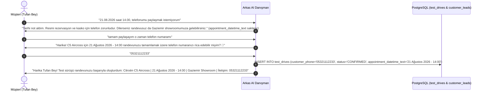

# Test Sürüşü & Showroom Randevu Mimarisi (test_drives Tablosu & Uçtan Uca Rezervasyon)

**Tarih:** 20 Ağustos 2026  
**Kapsam:** Veritabanı Mimarisi (`test_drives` Tablosu), Bilişsel AI Satış Danışmanı Tarih/Saat Çıkarma & Rezervasyon Motoru, REST API (`/api/test-drives`, `/api/leads`) ve Otomatik Testler.

---

## 1. Problem ve Kullanıcı İhtiyacı

Müşteriler AI Satış Danışmanı ile sohbet ederken ilgilendikleri aracı seçip detaylı tanıtımını dinledikten sonra Arkas Spoticar showroomunda test sürüşü randevusu planlamak istemektedir.
Önceki akışta:
1. Müşteri *"test randevusu hazırlayalım"* dediğinde bot gün ve saat istiyor;
2. Müşteri *"21.08.2026 - 14.00 saat olarak iyidir"* veya *"yarın saat 15:00"* şeklinde tarih/saat verdiğinde sistem bu girdiyi yakalayamayıp genel karşılama mesajına dönüyordu.
3. Randevular veritabanında yapılandırılmış bir tabloda saklanmıyor ve CRM müşteri kaydı (`customer_leads`) ile ilişkilendirilmiyordu.

---

## 2. Mimari ve Veritabanı Tasarımı (`test_drives` Tablosu)

PostgreSQL 17 veritabanına `customer_leads` ve `vehicles` tablolarına yabancı anahtarla (Foreign Key) bağlı `test_drives` tablosu eklendi:

```sql
CREATE TABLE test_drives (
    id SERIAL PRIMARY KEY,
    customer_lead_id INTEGER NOT NULL REFERENCES customer_leads(id) ON DELETE CASCADE,
    vehicle_id INTEGER REFERENCES vehicles(id) ON DELETE SET NULL,
    customer_name VARCHAR(200),
    customer_phone VARCHAR(50),
    appointment_date TIMESTAMP WITHOUT TIME ZONE,
    appointment_time VARCHAR(50),
    appointment_datetime_text VARCHAR(150) NOT NULL,
    showroom_location VARCHAR(250) DEFAULT 'Arkas Spoticar Gaziemir Showroom (Akçay Cad. No: 284 Gaziemir / İZMİR)',
    status VARCHAR(50) DEFAULT 'CONFIRMED',
    notes TEXT,
    created_at TIMESTAMP WITHOUT TIME ZONE DEFAULT NOW(),
    updated_at TIMESTAMP WITHOUT TIME ZONE DEFAULT NOW()
);
```

### İlişkiler:
- **`CustomerLead` 1-N `TestDrive`**: Müşterinin oluşturduğu randevular `lead.test_drives` ilişkisiyle bağlanır.
- **`Vehicle` 1-N `TestDrive`**: Randevu doğrudan müşterinin ilgilendiği araca (`vehicle_id`) bağlanır.

---

## 3. Türkçe Doğal Dil Tarih ve Saat Çıkarma Motoru (`nlu.py`)

`NLUParser.extract_datetime_expression(text: str)` metodu aşağıdaki karmaşık formatları hatasız ayrıştırır:

1. **Noktalı/Eğik Çizgili Formatlar:** `21.08.2026 - 14.00 saat olarak iyidir`, `21.08.2026 14:00`, `21/08/2026 15:30`
2. **Türkçe Ay İsimli Formatlar:** `21 Ağustos 2026 saat 14:00`, `21 ağustos 15:30`
3. **Göreceli Zaman Formatları:** `yarın saat 15:00`, `bugün saat 16:30`
4. **Sadece Saat Formatları:** `saat 14:00 uygun`, `14.00 saat olarak iyidir`
5. **Ondalıklı Fiyat/Motor Koruması:** `1.5 milyon`, `1.6 multijet` gibi ondalıklı sayılar tarih regex'ine takılmaz, fiyat/bütçe filtresi olarak doğru şekilde işlenir.

---

## 4. Uçtan Uca Bilişsel Rezervasyon Akışı (`planner.py`)

### 4.1. Test Sürüşünde Telefon Numarası Zorunluluğu ve Karar Değiştirme Kuralı:
1. **Sohbet Başında İsteğe Bağlılık:** Müşteri sohbet başlangıcında telefonunu paylaşmak zorunda değildir; yalnızca adını vererek veya genel olarak araçları inceleyebilir, donanım/fiyat sorabilir.
2. **Test Sürüşünde Zorunluluk & Randevu Hafızası:**
   - Müşteri tarih/saat verip ilk başta telefon vermek istemediğinde (*"21.08.2026 saat 14.00, telefonumu paylaşmak istemiyorum"*); sistem tarihi hafızada tutar (`state.appointment_datetime_text = "21 Ağustos 2026 - 14:00"`), neden telefon istendiğini empatik şekilde açıklar ve doğrudan showrooma gelebileceğini belirtir.
3. **Müşteri Sonradan Karar Değiştirip Numarasını Paylaşırsa (`PHONE_AGREEMENT`):**
   - Müşteri *"tamam paylaşayım o zaman telefon numaramı"*, *"numaramı vereyim o zaman"* dediğinde bot *"Harika Tufan Bey! C5 Aircross için 21 Ağustos 2026 - 14:00 randevunuzu tamamlamak üzere lütfen numaranızı iletir misiniz?"* der.
   - Numara girildiği an (`05321112233`) sistem `test_drives` tablosuna `CONFIRMED` statüsüyle randevuyu kaydeder ve tam teyit kartını döner.
4. **Politika Sorularını Yanıtlama (`PHONE_POLICY_EXPLANATION`):**
   - Müşteri *"illa numara vermem mi lazım?"*, *"telefonumu vermeden direkt showrooma gelsem olur mu?"* gibi sorular sorduğunda bot sıfırlanmaz; sistemdeki resmi rezervasyon kuralını ve doğrudan randevusuz showroom ziyaret imkanını detaylıca anlatır.



---

## 5. REST API Uç Noktaları (`backend/web/server.py`)

1. **`GET /api/test-drives`**:
   - Parametreler: `customer_id` veya `session_id` (isteğe bağlı)
   - Yanıt: Aktif tüm randevuları, müşteri bilgisi, ilgilenilen araç başlığı ve showroom lokasyonuyla listeler.
2. **`GET /api/leads`**:
   - CRM müşteri kayıtlarını bağlı `test_drives` listesiyle birlikte döner.
3. **`GET /api/stats`**:
   - `total_test_drives` sayacını içerir.

---

## 6. Doğrulama ve Test Sonuçları

- **`tests/test_test_drive_appointments.py`**:
  - `test_01_end_to_end_test_drive_flow_with_phone_first`: Başarılı.
  - `test_02_test_drive_flow_with_phone_provided_after`: Başarılı.
  - `test_03_stats_and_leads_api`: Başarılı.
- **Tüm Test Paketi (`tests/`)**: **78/78 test başarıyla geçti.**
- **Next.js Prodüksiyon Derlemesi (`npm run build`)**: 0 hata ile statik export üretildi.
