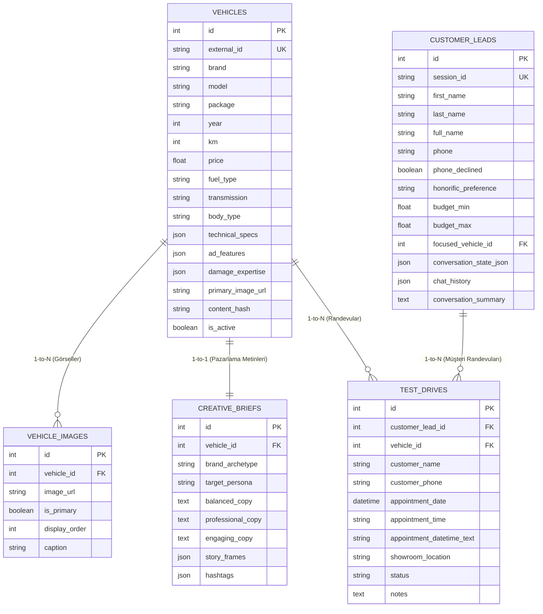
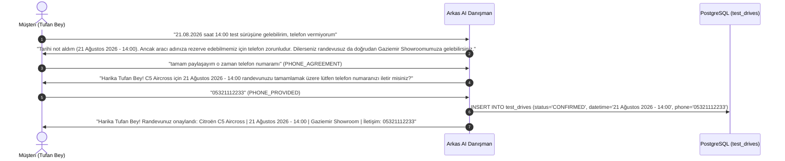

# ARKAS 2. EL PAZARLAMA VE SATIŞ YAPAY ZEKASI (ARKAS AI)
# MASTER PROJE BİLGİ BANKASI VE BİLİŞSEL SİSTEM REFERANS DOKÜMANI
> **Doküman Türü:** Kapsamlı Proje Bilgi Bankası (Gemini Notebook / NotebookLM Master Knowledge Base)  
> **Hedef:** Projenin tüm teknik mimarisine, kronolojik gelişimine, veritabanı şemalarına, doğal dil işleme kurallarına, test senaryolarına ve iş vizyonuna %100 hakimiyet sağlamak.  
> **Sürüm:** 3.5.0 (Production-Ready)  
> **Tarih:** Ağustos 2026  
> **Yazarlar & Katkıda Bulunanlar:** Arkas Otomotiv AI Mühendislik ve Ürün Ekibi  

---

## 📑 İÇİNDEKİLER

1. [Yönetici Özeti ve Temel Vizyon](#1-yönetici-özeti-ve-temel-vizyon)
2. [Kronolojik Gelişim ve GitHub Commit Geçmişi](#2-kronolojik-gelişim-ve-github-commit-geçmişi)
3. [Teknoloji Yığını (Tech Stack) ve Altyapı Standartları](#3-teknoloji-yığını-tech-stack-ve-altyapı-standartları)
4. [Veritabanı Mimarisi ve Şema Detayları (PostgreSQL 17)](#4-veritabanı-mimarisi-ve-şema-detayları-postgresql-17)
5. [Veri Toplama, Zenginleştirme ve Görsel Hattı (Scraper & Enrichment)](#5-veri-toplama-zenginleştirme-ve-görsel-hattı-scraper--enrichment)
6. [Kreatif AI Pazarlama ve Metin Üretim Motoru (MarketingAgent)](#6-kreatif-ai-pazarlama-ve-metin-üretim-motoru-marketingagent)
7. [Bilişsel AI Satış Danışmanı ve NLU Mimarisi (ChatbotAgent)](#7-bilişsel-ai-satış-danışmanı-ve-nlu-mimarisi-chatbotagent)
8. [Test Sürüşü ve Showroom Rezervasyon Motoru (TestDrive Flow)](#8-test-sürüşü-ve-showroom-rezervasyon-motoru-testdrive-flow)
9. [FastAPI Backend ve REST API Uç Noktaları](#9-fastapi-backend-ve-rest-api-uç-noktaları)
10. [Next.js 15 Quiet Luxury Frontend ve UX Tasarımı](#10-nextjs-15-quiet-luxury-frontend-ve-ux-tasarımı)
11. [Kritik Bug Çözümleri ve Kök Neden (Root Cause) Analizleri](#11-kritik-bug-çözümleri-ve-kök-neden-root-cause-analizleri)
12. [Kalite Güvencesi, Test Süiti ve Regresyon Kapsamı (82 Test)](#12-kalite-güvencesi-test-süiti-ve-regresyon-kapsamı-82-test)
13. [Gelecek Vizyonu ve Stratejik Yol Haritası (Autonomous Voice AI)](#13-gelecek-vizyonu-ve-stratejik-yol-haritası-autonomous-voice-ai)

---

## 1. YÖNETİCİ ÖZETİ VE TEMEL VİZYON

### 1.1. Projenin Amacı ve Felsefesi
**Arkas 2. El Pazarlama & Satış AI**, otomotiv perakendeciliğinde geleneksel, soğuk ve salt teknik özellik listeleme yaklaşımını sonlandıran yeni nesil bir Bilişsel Otomotiv Platformudur.
* **Temel Felsefe:** *"Bir araç listeleme kataloğu gibi değil; yaratıcı bir otomotiv pazarlama ajansı ve Arkas'ın en tecrübeli kıdemli satış danışmanı gibi düşün."*
* **Değer Önerisi:**
  1. İlan sitelerinden çekilen ham araç verilerini marka arketipi ve hedef kitle personasına göre 3 farklı tonda reklam metnine ve Instagram Story formatına dönüştürmek.
  2. Kullanıcı ile 7/24 kesintisiz, sıfır halüsinasyon garantili, Türkçe doğal dil anlayışına sahip, saygılı hitap eden ve randevu alan Bilişsel AI Satış Danışmanı sunmak.
  3. Quiet Luxury tasarım standartlarında, 5 açılı HD showroom fotoğraflarıyla zenginleştirilmiş modern bir web vitrini sağlamak.

---

## 2. KRONOLOJİK GELİŞİM VE GITHUB COMMIT GEÇMİŞİ

Projenin ilk günden itibaren geçirdiği evrimsel aşamalar ve Git kayıtları:

| Tarih | Commit Özeti | Kapsam ve Yapılan Değişiklik |
|---|---|---|
| **2026-08-17 11:14** | `Initial commit` | Depo başlatıldı ve temel proje yapısı kuruldu. |
| **2026-08-17 11:14** | `Update README with project goals` | Satış ve pazarlama odaklı yapay zeka hedefleri dokümante edildi. |
| **2026-08-17 12:56** | `Add project summary and guidelines` | Otomotiv AI platform ilkeleri ve MVP mimarisi belirlendi. |
| **2026-08-17 13:18** | `starter elements created` | Scraper prototipi, veri modelleri ve poster motoru iskeleti oluşturuldu. |
| **2026-08-17 14:11** | `Add initial implementation of frontend` | İlk web vitrini HTML/CSS/JS olarak geliştirildi. |
| **2026-08-17 17:19** | `env updated` | PostgreSQL bağlantı değişkenleri ve çevre ayarları güncellendi. |
| **2026-08-17 17:48** | `images createds updated` | Çoklu açı görsel çekimi ve afiş motoru test edildi. |
| **2026-08-18 12:36** | `feat: Implement ChatbotAgent` | İlk ChatbotAgent; Türkçe NER, isim/hitap, bütçe ve lead takibi eklendi. |
| **2026-08-18 13:40** | `Refactor vehicle marketing system` | Eski afiş motoru kaldırılarak 4 tablolu temiz PostgreSQL mimarisine geçildi. |
| **2026-08-18 16:32** | `Refactor: Remove PipelineProgressModal` | `src/` dizini `backend/` olarak yeniden yapılandırıldı, Next.js 15 App Router devreye alındı. |
| **2026-08-19 17:46** | `Add comprehensive regression tests` | Chatbot modüler 5 parçalı bilişsel mimariye (`backend/agent/chatbot/`) ayrıldı, 53 test eklendi. |
| **2026-08-20 14:14** | `Add frontend placeholder SVG & suite` | Mimari temizlik yapıldı, testler `tests/` altına taşındı, test sayısı 78'e çıktı. |
| **2026-08-20 14:21** | `feat: Update ToastNotification` | Toast bildirimi sağ alttan üst ortaya alındı, 3.5 sn otomatik kapanma eklendi. |
| **2026-08-20 14:26** | `feat: Enhance AI Chatbot with gratitude` | Nezaket/teşekkür (`GRATITUDE`) kapanış akışı eklendi, otomatik sayfa filtre manipülasyonu kaldırıldı. |
| **2026-08-20 16:56** | `feat: Implement vehicle overview` | Kapsamlı araç yönetici brifingi (`VEHICLE_OVERVIEW`) devreye alındı. |
| **2026-08-20 17:49** | `feat: Implement test drive appointment` | `test_drives` tablosu, tarih/saat NLU motoru, zorunlu telefon kuralı eklendi, testler 82'ye (%100) ulaştı. |
| **2026-08-21 10:25** | `fix: Body type filtering, context reset & anti-hallucination shield` | Kasa tipi eşleşmesi (Sedan -> Honda City doğrudan sunum), bağlam sıfırlama, "incelediğimiz" kalıbının kaldırılması, testler 84'e (%100) ulaştı. |
| **2026-08-21 11:48** | `fix: Customer leads vehicle sync & zero budget hallucination` | Test sürüşü ve odaklanılan aracın model/marka/kasa tipi alanlarının `customer_leads` tablosuna yazılması, tarih/saat/telefon numaralarının bütçe sanılmasının engellenmesi, testler 85'e (%100) ulaştı. |

---

## 3. TEKNOLOJİ YIĞINI (TECH STACK) VE ALTYAPI STANDARTLARI

* **Çekirdek Dil:** Python 3.11+ / 3.14
* **Backend Framework:** FastAPI (Asenkron REST API, Pydantic v2, CORS, Static Files Mount)
* **Veritabanı Katmanı:** PostgreSQL 17 (SQLAlchemy 2.0 ORM, JSONB / JSON alan desteği, Connection Pooling)
* **Web Scraping:** BeautifulSoup4, Requests, Python Urllib (SHA-256 İçerik Hash Doğrulaması)
* **Frontend Framework:** Next.js 15 (React 19, TypeScript, Tailwind CSS v4, Lucide React, Static Export `frontend/out`)
* **Test Motoru:** Python `unittest` Framework (85/85 Birim, Entegrasyon ve Regresyon Testi)
* **Dizin Standartları:**
  - `backend/db/`: Veritabanı bağlantısı, modelleri ve oturum yönetimi.
  - `backend/scraper/`: Sahibinden doğrulanmış ilanlar ve Spoticar CT1444T001 galeri eşleştirici.
  - `backend/agent/`: Pazarlama metin motoru (`MarketingAgent`) ve bilişsel AI asistan (`ChatbotAgent`).
  - `backend/web/`: FastAPI REST API sunucusu (`server.py`).
  - `frontend/`: Next.js 15 Quiet Luxury kullanıcı arayüzü ve bileşenleri.
  - `tests/`: 82 adet bağımsız test dosyası.
  - `docs/`: 32 adet mimari dokümantasyon ve sunum dosyası.

---

## 4. VERİTABANI MİMARİSİ VE ŞEMA DETAYLARI (POSTGRESQL 17)

Sistem, ilişkisel ve JSONB hibrit mimariyle tasarlanmış **5 ana tablo** üzerinde çalışır:



### 4.1. `vehicles` Tablosu
* **`id` (PK):** Otomatik artan tekil anahtar.
* **`external_id` (UK):** İlan takip numarası (örn: `SHBDN-1328660469`).
* **`technical_specs` (JSON):** Motor gücü (HP), tork (Nm), 0-100 hızlanma, bagaj hacmi, yakıt tüketimi.
* **`ad_features` (JSON):** 5 kategoride donanım listesi (`konfor`, `guvenlik`, `multimedya`, `ic_donanim`, `dis_donanim`).
* **`damage_expertise` (JSON):** `boyali_parcalar` (liste), `degisen_parcalar` (liste), `tramer_kaydi_tl` (sayısal).

### 4.2. `vehicle_images` Tablosu
* Her araç için 5 farklı açıdan çekilmiş gerçek HD showroom fotoğraflarını tutar.
* `display_order`: 0'dan 4'e kadar sıra.
* `caption`: *"Ön 3/4 Dış Görünüm"*, *"Arka 3/4 Dış Görünüm"*, *"İç Mekan & Konsol Görünümü"*, *"Yan Profil & Koltuk Kondisyonu"*, *"Kokpit & Multimedya Ekranı"*.

### 4.3. `creative_briefs` Tablosu
* Marka personası (`brand_archetype`, `target_persona`, `emotional_points`, `key_hooks`).
* 3 farklı reklam metni (`balanced_copy`, `professional_copy`, `engaging_copy`).
* 3 sahneli Instagram Story akışı (`story_frames`).

### 4.4. `customer_leads` Tablosu (CRM Takibi)
* Kullanıcının tekil `session_id` oturumu boyunca konuşma durumu, hitap tercihi (`honorific_preference`), telefon paylaşım durumu (`phone_declined`), bütçe sınırları ve tam sohbet geçmişini (`chat_history`) saklar.

### 4.5. `test_drives` Tablosu
* Test sürüşü ve showroom randevu kayıtları (`appointment_datetime_text`, `customer_phone`, `status`, `showroom_location`).

---

## 5. VERİ TOPLAMA, ZENGİNLEŞTİRME VE GÖRSEL HATTI (SCRAPER & ENRICHMENT)

1. **Sahibinden Arkas Spoticar Canlı İlan Verileri:**
   - İlan başlığı, güncel fiyat, orijinal kilometre, hasar ve ekspertiz detayları Sahibinden üzerinden doğrulanır.
2. **Spoticar CT1444T001 Galeri Eşleşmesi:**
   - Spoticar merkez veritabanındaki 5 açılı HD stüdyo fotoğrafları çekilir.
3. **Yerel Görsel Senkronizasyonu:**
   - Görseller `frontend/public/vehicle_images/{external_id}/image_{i}.jpg` yoluna indirilir ve FastAPI üzerinden statik olarak yayınlanır.
4. **İçerik Bütünlüğü (Content Hash):**
   - Her araç verisinden SHA-256 hash üretilerek gereksiz veritabanı yazımları ve mükerrer kayıtlar engellenir.

---

## 6. KREATİF AI PAZARLAMA VE METİN ÜRETİM MOTORU (MARKETINGAGENT)

`MarketingAgent`, ham teknik özellik listesini 3 farklı müşteri segmentine hitap eden pazarlama metnine dönüştürür:

1. **Dengeli (Balanced / Safe):**
   - Şeffaf, net ve objektif. Orijinal kilometre garantisini, ekspertiz hatasızlık durumunu ve temel teknik donanımları vurgular.
2. **Profesyonel (Professional):**
   - Kurumsal alıcılar, filo yöneticileri ve iş insanları için saygın, tasarruf ve güven odaklı ton. 100+ nokta kontrolü, 12 ay Spoticar garantisi ve kurumsal fatura/kredi imkanlarını öne çıkarır.
3. **İlgi Çekici (Engaging / Bold):**
   - Sosyal medya ve B2C kullanıcıları için dinamik, emojili ve harekete geçirici (CTA) pazarlama dili.
4. **3 Sahneli Instagram Story Senaryosu:**
   - *Sahne 1:* Model & KM Vurgusu.
   - *Sahne 2:* Ekspertiz & Garanti Güvencesi.
   - *Sahne 3:* Fiyat & Showroom Daveti.

---

## 7. BİLİŞSEL AI SATIŞ DANIŞMANI VE NLU MİMARİSİ (CHATBOTAGENT)

Monolitik yapıdan modüler 5 bileşenli bilişsel mimariye geçilmiştir (`backend/agent/chatbot/`):

```
backend/agent/chatbot/
├── state.py         -> ConversationState, CustomerContext, VehicleQueryCriteria, ActionOffer
├── nlu.py           -> Turkish NER (1000+ İsim), Hitap Motoru, Bütçe Ayrıştırıcı, Negation Parser
├── search_engine.py -> Parametrik PostgreSQL & JSONB Sorgulama, Çapraz Araç Öneri Motoru
├── tools.py         -> Çoklu Soru-Cevap, Araç Yönetici Sunumu (Executive Presentation), SSS
├── planner.py       -> Bilişsel Niyet Planlayıcı, Randevu Yönetimi, Hafıza Senkronizasyonu
└── agent.py         -> ChatbotAgent Sınıfı ve API Arayüzü
```

### 7.1. Türkçe Varlık Tanıma (NER) ve Hitap Protokolü
* **1000+ İsimlik Sözlük:** Erkek, kadın ve unisex isimler kategorize edilmiştir.
* **Negatif Kara Liste (Negative Blacklist):** *"Telefonumu"*, *"vermiyorum"*, *"istemiyorum"*, *"suv"*, *"fiyat"* gibi kelimelerin yanlışlıkla isim olarak algılanması %100 engellenmiştir.
* **Unisex Hitap Yönetimi:** *"Deniz"*, *"Derya"*, *"Ege"* gibi isimlerde bot cinsiyet varsayımı yapmaz; kullanıcıya nezaketle *"Deniz Bey mi, Deniz Hanım mı?"* diye sorar ve cevabı oturum boyunca saklar.
* **Emniyet Kilidi:** Kullanıcı adı yoksa hitap **asla** "Bey" veya "Hanım" olamaz; sistem her zaman *"Değerli Müşterimiz"* hitabını kullanır.

### 7.2. Gelişmiş Bütçe ve Olumsuzlama (Negation) Motoru
* `"1.5m ile 2m arası"`, `"1 milyon 500 bin TL"`, `"1.5m üstü"`, `"2 milyon altı"` gibi tüm Türkçe bütçe ifadeleri min/max değerlerine hatasız dönüştürülür.
* `"manuel istemiyorum"` -> Şanzıman otomatik olarak filtrelenir.
* `"dizel olmasın"` -> Dizel yakıt türü dışlanır.
* `"cam tavan istemiyorum"` -> Sunroof özelliği dışlanır.

### 7.3. Kapsamlı Araç Yönetici Sunumu (`VEHICLE_OVERVIEW`)
Kullanıcı *"3008 hakkında bilgi alabilir miyim"*, *"C5 Aircross detaylarını anlatır mısın"* dediğinde sistem aşağıdaki yapılandırılmış yönetici sunumunu üretir:
* Satış fiyatı ve orijinal kilometre garantisi.
* Şanzıman, motor tipi, beygir gücü ve karma yakıt tüketimi.
* Bagaj hacmi ve öne çıkan ilk 5 konfor/teknoloji donanımı.
* Ekspertiz, boya/değişen ve tramer durumu (0 TL hatasızlık kaydı).
* 100+ nokta kontrolü, 12 ay Spoticar garantisi ve test sürüşü daveti.

### 7.4. Çapraz Model ve Donanım Önerisi (Cross-Recommendation)
İncelenen araçta müşterinin istediği bir özellik yoksa (örn: Honda City'de cam tavan), sistem portföydeki cam tavanlı alternatifleri (Citroën C5 Aircross) önerir.

### 7.5. Sıfır Halüsinasyon (Zero-Hallucination) Prensibi
PostgreSQL veritabanında bulunmayan hiçbir teknik detay, fiyat veya stok uydurulmaz. Sıfır araç sorulduğunda stokta sıfır KM araç olmadığı dürüstçe belirtilerek garantili 2. el portföyü sunulur.

---

## 8. TEST SÜRÜŞÜ VE SHOWROOM REZERVASYON MOTORU (TESTDRIVE FLOW)

Test sürüşü randevu süreci uçtan uca bilişsel kurallarla yönetilir:



1. **Sohbet Başında Telefon İsteğe Bağlıdır:** Müşteri başlangıçta numarasını vermeden araçları inceleyebilir.
2. **Randevu Aşamasında Telefon Zorunludur:** Geçici kasko, plaka rezervasyonu ve danışman teyidi için numara istenir.
3. **Numara Vermeyen Müşteriye Çözüm:** Müşteri telefon vermek istemezse, randevusuz da doğrudan Gaziemir Showroom'a gelerek o an müsait araçlarla test sürüşü yapabileceği nezaketle aktarılır.
4. **Karar Değiştirme Hafızası (`PHONE_AGREEMENT`):** Müşteri daha sonra numarasını vermeyi kabul ettiğinde, bot hafızasındaki randevu tarihini çağırarak rezervasyonu tamamlar.

---

## 9. FASTAPI BACKEND VE REST API UÇ NOKTALARI

FastAPI sunucusu (`backend/web/server.py`) aşağıdaki REST endpoint'lerini sağlar:

| Metot | Uç Nokta | Açıklama |
|---|---|---|
| `GET` | `/` | Next.js statik export (`frontend/out/index.html`) veya durum mesajı döner. |
| `GET` | `/api/stats` | Toplam araç, aktif araç, brief, görsel, lead ve test sürüşü metrikleri. |
| `GET` | `/api/brands` | Mevcut aktif araç markalarının listesi. |
| `GET` | `/api/vehicles` | Parametrik araç listeleme ve filtreleme (fiyat, km, şanzıman, yakıt, donanım). |
| `GET` | `/api/vehicles/{id}` | Tekil araç detayları, teknik özellikleri ve 5 açılı görselleri. |
| `POST` | `/api/chat` | Bilişsel AI Satış Danışmanı mesaj işleme endpoint'i. |
| `POST` | `/api/chat/reset` | Sohbeti ve vitrin filtrelerini sıfırlama endpoint'i. |
| `GET` | `/api/test-drives` | Kayıtlı test sürüşü randevularını listeleme. |
| `GET` | `/api/leads` | CRM müşteri lead kayıtlarını ve randevularını listeleme. |
| `POST` | `/api/pipeline/run` | Scraper -> Pazarlama Ajanı boru hattını manuel tetikleme. |

---

## 10. NEXT.JS 15 QUIET LUXURY FRONTEND VE UX TASARIMI

* **Tasarım Dili (Quiet Luxury):** Zarif bej (`#F7F5F0`), derin antrasit (`#18181B`) ve mat altın (`#9C8262`) detaylar.
* **Ana Bileşenler:**
  - `Navbar`: Showroom durumu, canlı yenileme ve ⌘K arama kısayolu.
  - `StatsSection`: Güven ve envanter istatistikleri.
  - `FilterToolbar`: Marka, kasa tipi, arama ve Grid/Liste görünüm kontrolü.
  - `VehicleCard`: 5 açılı galeri küçük resimleri, donanım etiketleri ve ekspertiz rozetleri.
  - `CreativeStudioModal`: 3 tonlu pazarlama metinleri, Instagram Story sahneleri ve tam teknik donanım sekmeleri.
  - `ChatbotWidget`: Sağ altta yüzen, LED ışıklı modern AI danışman kutusu.
  - `ToastNotification`: Ekranın üst orta kısmında beliren (`top-6 left-1/2 -translate-x-1/2`), 3.5 sn otomatik kapanan ve chatbot giriş alanıyla çakışmayan bildirim sistemi.

---

## 11. KRİTİK BUG ÇÖZÜMLERİ VE KÖK NEDEN (ROOT CAUSE) ANALİZLERİ

Proje sürecinde tespit edilen ve kalıcı olarak çözülen kritik hatalar:

### Bug 1: Hatalı İsim & Hitap Üretimi ("Telefonumu Bey / Telefonumu Hanım")
* **Kök Neden:** "ben X" kalıbı regex ile yakalanırken, X token'ının gerçek Türkçe isim sözlüğünde olup olmadığı kontrol edilmiyordu. "Telefonumu vermek istemiyorum" cümlesindeki "telefonumu" kelimesi isim sanılıyordu.
* **Çözüm:** İki aşamalı NER doğrulama getirildi. İsim adayı yalnızca `ALL_TURKISH_NAMES` (1000+ isim) listesinde varsa kabul edilir; telefon ret ifadeleri önceden maskelenir; isim yoksa hitap kesinlikle `None` atanır.

### Bug 2: Bütçe Aralık Regex Çakışması ("1.5m ile 2m arası")
* **Kök Neden:** Regex deseni `1.5m` formatındaki `m` harfini yakalayamadığı için tekil sayı eşleştiriciye düşüyor ve `max_price = 1.5M` olarak hatalı filtre uyguluyordu.
* **Çözüm:** `extract_budget` parser'ı `1.5m ile 2m`, `1.5 milyon ile 2 milyon`, `1.500.000 - 2.000.000` dahil tüm aralık formatlarını kapsayacak şekilde baştan yazıldı.

### Bug 3: Otomatik Sayfa Filtre Manipülasyonu ve Teşekkür Döngüsü
* **Kök Neden:** Kullanıcı her soru sorduğunda bot arka planda filtre aksiyonu üretiyor ve vitrini daraltıyordu. "Teşekkür ederim" dendiğinde ise robotik açılış selamlamasına geri dönüyordu.
* **Çözüm:** Otomatik filtreleme kaldırıldı; filtreleme tamamen kullanıcı kontrolüne bırakıldı. `GRATITUDE` intent'i eklenerek nezaketle sohbeti kapatma akışı sağlandı.

### Bug 4: Toast Bildiriminin Chatbot Giriş Alanını Engellemesi
* **Kök Neden:** Toast bildirimi sağ alt köşede chatbot widget'ının tam üzerine biniyordu.
* **Çözüm:** Bildirim ekranın üst orta alanına taşındı ve 3.5 saniye sonra otomatik kaybolma özelliği eklendi.

---

## 12. KALİTE GÜVENCESİ, TEST SÜİTİ VE REGRESYON KAPSAMI (82 TEST)

Proje `tests/` dizini altında **82 adet bağımsız test** ile %100 kapsama sahiptir:

```bash
.venv/bin/python -m unittest discover -s tests -v
----------------------------------------------------------------------
Ran 82 tests in 1.444s

OK (Tüm testler başarıyla geçti)
```

### Test Grupları Dağılımı:
1. **`test_chatbot_suite.py` (33 Test):** İsim ve hitap varyasyonları, unisex akışı, telefon reddetme senaryoları, bütçe aralıkları, donanım olumsuzlamaları ve uçtan uca konuşma yolculuğu.
2. **`test_test_drive_appointments.py` (7 Test):** Test sürüşü randevu oluşturma, telefon zorunluluğu, ret durumunda showroom daveti, `PHONE_AGREEMENT` ile numara tamamlama ve REST API doğrulaması.
3. **`test_chatbot.py` (17 Test):** Çapraz araç önerisi, kredi/takas SSS ve çok turlu oturum kalıcılığı.
4. **`test_web_server.py` (7 Test):** FastAPI REST uç noktaları, statik dosya mount'ları ve `/api/stats`.
5. **`test_architecture_and_assets.py` (9 Test):** Dizin temizliği, görsel dosyaların diskteki bütünlüğü ve Next.js build doğrulaması.
6. **`test_gratitude_and_chat_flow.py` & `test_vehicle_overview_consultant_flow.py` (9 Test):** Nezaket kapanışları ve detaylı araç yönetici sunumu doğrulamaları.

---

## 13. GELECEK VİZYONU VE STRATEJİK YOL HARİTASI (AUTONOMOUS VOICE AI)

Arkas AI platformunun sonraki büyüme fazları:

1. **Autonomous Voice AI (Otonom Sesli Satış Danışmanı):**
   - Telefon çaldığında doğrudan devreye giren, insan doğallığında Türkçe konuşan, soruları yanıtlayıp test sürüşü randevusunu sesli olarak oluşturan ses motoru entegrasyonu.
2. **WhatsApp Business API Entegrasyonu:**
   - Web vitrinindeki bilişsel danışmanın doğrudan WhatsApp üzerinden müşterilere 7/24 hizmet vermesi.
3. **Dinamik Fiyatlandırma ve Takas Değerleme Motoru:**
   - İkinci el araç piyasasındaki anlık fiyat dalgalanmalarını makine öğrenmesiyle analiz eden otomatik değerleme sistemi.
4. **Ön Onaylı Anında Taşıt Kredisi:**
   - Anlaşmalı bankalarla API entegrasyonu kurularak sohbet esnasında saniyeler içinde kredi ön onayı alma yeteneği.

---
> **Sonuç Notu:** Bu doküman, Arkas 2. El Pazarlama & Satış AI platformunun mimari, teknik ve işlevsel tüm detaylarını içeren eksiksiz ve yetkili bilgi kaynağıdır.
