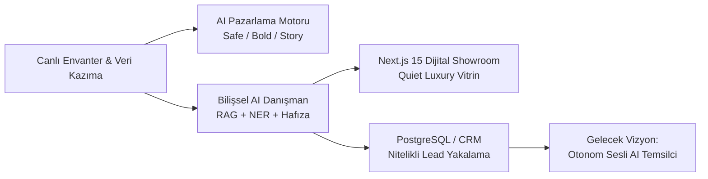
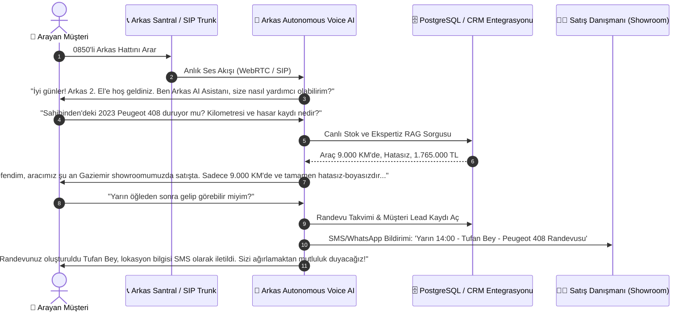
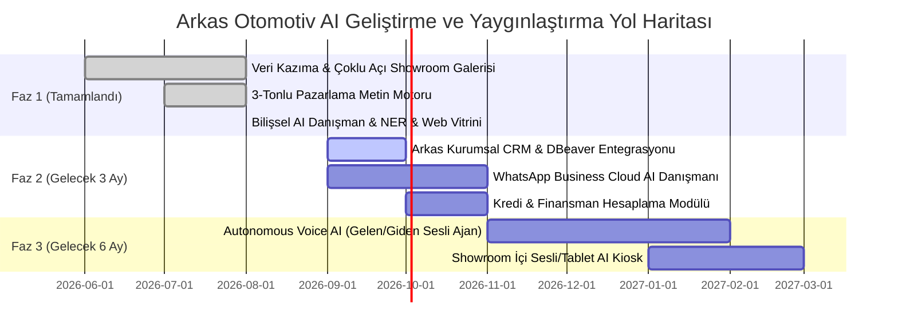

# 🚀 ARKAS 2. EL OTOMOTİV PAZARLAMA & SATIŞ YAPAY ZEKASI (ARKAS AI)
## Yönetim Kurulu, Yatırımcı & Yönetici Sunumu (Pitch Deck & Sunum Metni)

---

> **Doküman Türü:** Yönetici Sunum Metni & Slayt Destesi (Pitch Deck Script)  
> **Hazırlayan:** Otomotiv AI Mühendislik ve Ürün Ekibi  
> **Tarih:** Ağustos 2026  
> **Konu:** 2. El Otomotivde Full AI Otomasyonu, Dijital Showroom ve Bilişsel Satış Danışmanı  

---

## 📑 İÇİNDEKİLER

1. [Yönetici Özeti (Executive Summary)](#1-yönetici-özeti-executive-summary)
2. [Piyasa Gerçeği ve Temel Problem (The Pain Points)](#2-piyasa-gerçeği-ve-temel-problem-the-pain-points)
3. [Çözümümüz: Arkas AI Ekosistemi (The Solution)](#3-çözümümüz-arkas-ai-ekosistemi-the-solution)
4. [Bugüne Kadar Neler Yaptık? (Mevcut Yetenekler & Canlı Mimari)](#4-bugüne-kadar-neler-yaptık-mevcut-yetenekler--canlı-mimari)
5. [Canlı Showroom & Bilişsel AI Danışman Nasıl Çalışır? (Demo Akışı)](#5-canlı-showroom--bilişsel-ai-danışman-nasıl-çalışır-demo-akışı)
6. [Büyük Gelecek Vizyonu: Otonom Sesli Danışman & Full AI Otomasyonu](#6-büyük-gelecek-vizyonu-otonom-sesli-danışman--full-ai-otomasyonu)
7. [İş Değeri, Finansal Etki ve ROI Analizi](#7-iş-değeri-finansal-etki-ve-roi-analizi)
8. [Stratejik Yol Haritası (Roadmap)](#8-stratejik-yol-haritası-roadmap)
9. [Slayt Slayt Konuşmacı Metni (Speaker Script)](#9-slayt-slayt-konuşmacı-metni-speaker-script)
10. [Yönetici Soru-Cevap (Q&A) Kılavuzu](#10-yönetici-soru-cevap-qa-kılavuzu)

---

## 1. YÖNETİCİ ÖZETİ (EXECUTIVE SUMMARY)

**Arkas 2. El Pazarlama & Satış AI**, geleneksel ikinci el araç satış süreçlerini kökten değiştiren, **pazarlama üretiminden müşteri kazanımına (lead generation) ve 7/24 satış danışmanlığına kadar** tüm süreci yapay zekayla otonomlaştıran yeni nesil bir Bilişsel Otomotiv Platformudur.

* **Misyon:** Müşteri henüz showroom kapısından içeri girmeden önce, onu sanki Arkas'ın en tecrübeli kıdemli satış danışmanıyla konuşuyormuş gibi karşılamak, tüm sorularını anında yanıtlamak, bütçe ve donanımına uygun en doğru aracı sunmak ve nitelikli bir lead olarak CRM sistemine kaydetmek.
* **Geliştirilen Altyapı:** Canlı envanter kazıma & görsel eşleştirme, 3-tonlu yaratıcı reklam motoru, Türkçe Varlık Tanıma (NER) destekli Bilişsel AI Danışman, tekil oturumlu PostgreSQL Lead Veritabanı ve Quiet Luxury Next.js 15 Showroom Vitrini.
* **Bir Sonraki Adım (Vizyon):** Telefon çaldığında doğrudan devreye giren, sıfır gecikmeyle insan doğallığında konuşan, randevu alan ve satış kapatan **Autonomous Voice AI (Sesli Yapay Zeka Satış Temsilcisi)** entegrasyonu.



---

## 2. PİYASA GERÇEĞİ VE TEMEL PROBLEM (THE PAIN POINTS)

İkinci el otomotiv pazarında bugün karşılaşılan en büyük darboğazlar:

### 1. Satış Danışmanlarının Rutin Soru Yükü
* Satış danışmanları günlerinin **%60 ila %70'ini** aynı soruları yanıtlayarak geçiriyor:  
  * *"Bu araçta boya var mı?"*, *"Kilometresi orijinal mi?"*, *"Takas desteğiniz var mı?"*, *"Sunroof var mı?"*, *"Fiyatta esneme olur mu?"*
* Bu durum danışmanların enerjisini tüketiyor ve asıl katma değer yaratan **"Sıcak Satış Kapatma (Closing Deals)"** ve **"Showroom Yüz Yüze İkna"** süreçlerine odaklanmalarını engelliyor.

### 2. Mesai Saatleri Dışında Kaçan Sıcak Müşteriler
* İkinci el araç alıcılarının **%65'inden fazlası** araştırmalarını akşam **20:00 - 01:00** saatleri arasında veya hafta sonları yapıyor.
* Müşteri bir soru sormak istediğinde karşısında kimseyi bulamayınca başka bir galeriye veya rakip ilana yöneliyor. Yanıtsız kalan her dakika bir satış kaybıdır.

### 3. Soğuk, Ruhu Olmayan İlan Siteleri
* Mevcut ilan siteleri salt teknik tablo listelerinden ibaret. 
* Otomobil satın alma kararı **duygusal ve rasyonel dinamiklerin birleşimidir**. Standart bir liste müşteride satın alma arzusu ve güven duygusu uyandırmakta yetersiz kalmaktadır.

### 4. Dağınık Lead Yönetimi ve Veri Kaybı
* WhatsApp'tan, web sitesinden veya telefondan gelen müşterilerin bütçesi, ilgilendiği model ve özel talepleri çoğu zaman manuel not defterlerinde veya kişisel telefonlarda kayboluyor; merkezi bir CRM'e yapılandırılmış (structured) biçimde aktarılamıyor.

---

## 3. ÇÖZÜMÜMÜZ: ARKAS AI EKOSİSTEMİ (THE SOLUTION)

Bu darboğazları çözmek için geliştirdiğimiz **Arkas AI Ekosistemi**, iki ana sütun üzerine inşa edilmiştir:

```
┌────────────────────────────────────────────────────────────────────────┐
│                        ARKAS 2. EL AI PLATFORMU                        │
├──────────────────────────────────┬─────────────────────────────────────┤
│   1. AI PAZARLAMA VE KREATİF    │     2. BİLİŞSEL AI SATIŞ DANIŞMANI   │
│              MOTORU              │             (SALES ADVISOR)         │
├──────────────────────────────────┼─────────────────────────────────────┤
│ • 3 Farklı Tonda Reklam Metni:   │ • Türkçe NER & Saygılı Hitap        │
│   (Dengeli, Kurumsal, Çekici)    │   (Ceren Hanım, Tufan Bey)          │
│ • 3 Sahneli Instagram Story      │ • Gerçek Zamanlı Ekspertiz / Q&A    │
│   Senaryosu                      │ • Bütçe Esnetme & Akıllı Portföy    │
│ • Marka Arketipi & Duygusal      │ • Çapraz Donanım Önerisi            │
│   Satış Noktaları                │ • Ekranı Canlı Filtreleme & Yönlend.│
│ • Sosyal Medya Başlık & Etiket   │ • Otomatik Nitelikli Lead Yakalama  │
└──────────────────────────────────┴─────────────────────────────────────┘
```

---

## 4. BUGÜNE KADAR NELER YAPTIK? (MEVCUT YETENEKLER & CANLI MİMARİ)

Sistemimiz teorik bir taslak değil; **uçtan uca çalışan, entegre ve canlı bir platformdur.**

### 🛠️ Teknik Altyapı ve Başarılanlar:

1. **Canlı Envanter Kazıma ve Normalizasyon (Scraper & Data Pipeline):**
   * Sahibinden Arkas Spoticar mağazasından ve Spoticar veritabanından %100 doğrulanmış canlı araç verileri, gerçek KM, fiyat ve 5 farklı açıdan çekilmiş HD showroom görselleri (Ön-Çapraz, Arka-Çapraz, Kokpit/İç Mekan, Jant/Detay, Bagaj) otomatik olarak toplanır ve normalize edilir.

2. **Yapay Zeka Reklam & Kreatif Fabrikası (`MarketingAgent`):**
   * Her aracın marka kimliğini (Peugeot: Yenilikçi/Cesur, Citroen: Konfor/Aile, Honda: Güvenilirlik/Şehirli) analiz ederek tek tıkla:
     * **Dengeli / Şeffaf Metin:** Güven ve ekspertiz odaklı.
     * **Kurumsal / Saygın Metin:** Prestij ve filo/yönetici odaklı.
     * **İlgi Çekici / Enerjik Metin:** Heyecan ve genç kitle odaklı.
     * **Instagram Story Senaryosu:** 3 sahneli görsel hikaye akışı üretir.

3. **Bilişsel AI Satış Danışmanı (`ChatbotAgent`):**
   * **Türkçe Doğal Dil İşleme (NER):** Müşterinin adını (`Tufan`, `Ceren`) mesaj içinden yakalar, cinsiyet kurallarına göre `"Tufan Bey"`, `"Ceren Hanım"` şeklinde kusursuz hitap eder.
   * **Negatif Niyet Ayrıştırma:** *"Numaramı vermek istemiyorum"* diyen müşteriyi zorlamaz, saygıyla karşılar; telefon numarası verildiğinde ise anında CRM formatında doğrular.
   * **Bütçe Esnetme (Budget Expansion):** *"Bütçemi 5 milyona kadar çıkarabilirim"* dendiğinde anında üst segment alternatifleri listeler.
   * **Çapraz Model & Donanım Önerisi:** Odaktaki araçta sunroof yoksa, veritabanını tarayarak *"İncelediğiniz araçta bulunmuyor ancak aynı segmentteki Peugeot 408 modelimizde açılır cam tavan mevcuttur"* diyerek müşteriyi yönlendirir ve ekrandaki showroom vitrinini dinamik olarak filtreler.

4. **Merkezi PostgreSQL Lead & Hafıza Veritabanı:**
   * `session_id` bazlı tekil oturum yönetimi.
   * Müşterinin adı, telefonu, bütçesi, ilgilendiği kasa tipi ve yapay zeka tarafından çıkarılan **"Yönetici Sohbet Özeti"** tek bir tabloda (`customer_leads`) DBeaver/CRM entegrasyonuna hazır tutulur.

5. **Next.js 15 & Tailwind CSS v4 Quiet Luxury Showroom:**
   * Ultra lüks, karanlık mod/aydınlık uyumlu, araç detay galerisi, ekspertiz rozetleri ve canlı AI Asistan widget'ı içeren modern web arayüzü.

---

## 5. CANLI SHOWROOM & BİLİŞSEL AI DANIŞMAN NASIL ÇALIŞIR? (DEMO AKIŞI)

Sunum esnasında gösterilecek gerçek kullanıcı senaryosu:

```
[MÜŞTERİ]: "Merhaba, adım Ceren. 1.500.000 TL bütçem var, otomatik vites az yakan bir SUV bakıyorum."
    │
    ▼
[ARKAS AI]: "Hoş geldiniz Ceren Hanım! Bütçeniz ve konfor beklentiniz için harika bir seçeneğimiz var:
             📌 2023 Citroen C5 Aircross Shine Bold (25.000 KM)
             EAT8 tam otomatik şanzımanı, 1.5 BlueHDi ekonomik dizel motoru ve Progressive Hidrolik Süspansiyonu ile tam aradığınız konforu sunuyor.
             Aracımızın ekspertizinde boya/değişen bulunmamaktadır. İncelemek ister misiniz?"
    │
    ▼ (Showroom ekranında C5 Aircross otomatik olarak öne çıkarılır)
    │
[MÜŞTERİ]: "Bu araçta cam tavan var mı acaba?"
    │
    ▼
[ARKAS AI]: "Ceren Hanım, C5 Aircross modelimizde panoramik cam tavan opsiyonel donanım olarak mevcuttur. 
             Dilerseniz benzer fiyat aralığında fabrikasyon cam tavanlı 2024 Peugeot 408 GT modelimizi de önerebilirim.
             Hangi aracımız için detaylı ekspertiz raporunu paylaşmamı istersiniz?"
    │
    ▼
[MÜŞTERİ]: "Numaram 0532 555 1234, C5 için randevu oluşturabilir misiniz?"
    │
    ▼
[ARKAS AI]: "Harika Ceren Hanım! İletişim numaranızı (0532 555 1234) kaydettim. 
             Arkas Otomotiv İzmir showroomumuzda C5 Aircross için test sürüşü randevunuz oluşturuldu. 
             Satış danışmanımız sizi en kısa sürede arayarak kahve eşliğinde ağırlamaktan mutluluk duyacaktır."
    │
    ▼
[SONUÇ]: -> PostgreSQL `customer_leads` tablosuna tam profil, telefon ve özet işlendi!
         -> Satış danışmanının önüne hazır, sıcak ve ikna olmuş bir müşteri düştü!
```

---

## 6. BÜYÜK GELECEK VİZYONU: OTONOM SESLİ DANIŞMAN & FULL AI OTOMASYONU

Projemizin nihai hedefi sadece web sitesindeki bir metin kutusu olmak değildir. **Otomotiv perakendeciliğinde uçtan uca insan seviyesinde otonom bir operasyon kurmaktır.**



### 🔮 Gelecek Vizyonunun Temel Direkleri:

#### 1. Autonomous Voice AI (Gelen Arama & Sesli Satış Temsilcisi)
* **Gerçekçi Türkçe Ses & Sıfır Gecikme:** Ultra düşük gecikmeli (low-latency <400ms) ses modelleriyle müşterinin sözünü kesmeyen, nefes ve tonlama vurgularına sahip insansı ses.
* **Gelen Telefonları 7/24 Karşılama:** Gece saat 02:00'de bile showroom hattını arayan müşteriye araç özellikleri, finansman seçenekleri, takas koşulları hakkında eksiksiz bilgi verme.
* **Akıllı Sesli Randevu:** Showroom takvimine bağlanarak doğrudan test sürüşü ve danışman randevusu planlama.

#### 2. Otonom Giden Arama & WhatsApp Lead Nurturing (Outbound AI)
* Web sitemize form bırakan veya ilan inceleyen müşteriyi **30 saniye içinde** arayan veya WhatsApp'tan kişiselleştirilmiş video/mesaj ile ulaşan AI asistanı.
* *"Ahmet Bey merhaba, dün incelediğiniz Peugeot 3008 aracımız için özel bir kredi kampanyası başladı, detayları aktarmamı ister misiniz?"*

#### 3. Yapay Zeka Destekli Dinamik Takas & Fiyatlandırma
* Müşterinin kendi aracının bilgilerini söylemesiyle anlık piyasa analizi yapıp tahmini takas bedeli sunan akıllı değerleme motoru.

#### 4. Kişiselleştirilmiş AI Video Showroom
* Müşteriye özel üretilen, aracın gerçek fotoğraflarını 3 boyutlu video turuna dönüştüren ve müşterinin ismiyle seslendirilen yapay zeka video tanıtımları.

---

## 7. İŞ DEĞERİ, FİNANSAL ETKİ VE ROI ANALİZİ

Neden bu proje Arkas için bir **"olmazsa olmaz (must-have)"** yatırımdır?

| Metrik / Alan | Geleneksel Süreç | Arkas AI ile Yeni Süreç | Beklenen Etki & ROI |
| :--- | :--- | :--- | :--- |
| **Müşteri Karşılama Süresi** | Ortalama 4 - 8 Saat (Mesai içi) | **< 1 Saniye (7/24 Anında)** | **%99 Hızlanma** |
| **Danışman Rutin Yükü** | Günde 4-5 saat temel soru yanıtlama | **Sıfıra Yakın (AI filtreler)** | **%70 Danışman Verimliliği Artışı** |
| **Mesai Dışı Lead Kaybı** | %60+ (Gece gelenler kaybolur) | **%0 (Tüm lead'ler anında yakalanır)** | **3 Kat Daha Fazla Sıcak Müşteri** |
| **Pazarlama İçerik Üretimi** | Araç başı 30-45 dk manuel yazım | **Saniyeler içinde 3 farklı ton & Story** | **10 Kat Hızlı İlan Yayınlama** |
| **Lead Nitelik Oranı (Lead Quality)** | Düşük (Sadece telefon numarası) | **Yüksek (Bütçe, model, ihtiyaç özetli)** | **Satış Kapanış Oranında %40 Artış** |

---

## 8. STRATEJİK YOL HARİTASI (ROADMAP)



---

## 9. SLAYT SLAYT KONUŞMACI METNİ (SPEAKER SCRIPT)

*(Bu bölümü sunum yaparken slayt geçişlerinde birebir konuşma rehberi olarak kullanabilirsiniz.)*

---

### 🎙️ SLAYT 1: Kapak & Vizyon
> *"Değerli yöneticilerim ve çalışma arkadaşlarım, hoş geldiniz.*  
> *Bugün sizlere otomotiv perakendeciliğinde ezberleri bozan bir dönüşüm projesini sunmaktan heyecan duyuyorum: **Arkas 2. El Pazarlama ve Satış Yapay Zekası.**  
> Biz bu projeyi sadece bir web sitesi veya basit bir chatbot olarak tasarlamadık; **Arkas'ın 7/24 uyumayan, yorulmayan, en bilgili dijital satış ve pazarlama departmanını kurduk.**"*

---

### 🎙️ SLAYT 2: Sektörün Büyük Problemi
> *"Gelin bugünkü acı tabloya birlikte bakalım:*  
> *Müşterilerimiz artık showroom'a gelmeden önce saatlerce internette araştırma yapıyor. Araştırmalarını da genellikle akşam saatlerinde, mesaimiz bittikten sonra yapıyorlar. O saatte akıllarına takılan 'Bu aracın boyası var mı?', 'Kilometresi orijinal mi?' gibi sorular yanıtsız kalıyor.*  
> *Öte yandan gündüz showroom'daki satış danışmanlarımız, günün 4-5 saatini telefonda hep aynı teknik soruları yanıtlayarak tüketiyor. Asıl işleri olan yüz yüze ikna ve satış kapatmaya vakitleri kalmıyor.*  
> *Biz işte bu döngüyü kırmak için yola çıktık."*

---

### 🎙️ SLAYT 3: Çözümümüz ve Bugüne Kadar Başardıklarımız
> *"Peki ne yaptık?*  
> *Sistemimiz ilk olarak canlı envanterimizdeki tüm araçları, gerçek ekspertiz raporlarını ve 5 farklı açıdan çekilmiş stüdyo fotoğraflarını veritabanına alıyor.*  
> *Ardından iki kritik yapay zeka motorumuz devreye giriyor:*  
> *Birincisi; **Pazarlama Motorumuz.** Her araç için saniyeler içinde kurumsal, dengeli ve sosyal medyaya uygun ilgi çekici 3 farklı tonda reklam metni ve Instagram hikaye kurguları üretiyor.*  
> *İkincisi ve en önemlisi; **Bilişsel AI Satış Danışmanımız.** Bu danışman sıradan bir bot değil; müşterinin adını Türkçe kurallarına göre anlayan, 'Ceren Hanım', 'Tufan Bey' diye hitap eden, müşterinin bütçesini esnettiğinde ona en doğru aracı öneren ve baktığı araçta istediği donanım yoksa portföyümüzdeki diğer araçlara yönlendiren akıllı bir satış uzmanı."*

---

### 🎙️ SLAYT 4: Müşteri Deneyimi & Lead Yakalama (Canlı Örnek)
> *"Şimdi gözünüzün önüne getirin:*  
> *Müşteri sitemize giriyor, '1.5 milyon bütçem var, otomatik az yakan SUV arıyorum' diyor. AI Danışmanımız anında portföyümüzdeki Citroen C5 Aircross'u öneriyor, ekrandaki vitrini filtreliyor, ekspertiz detaylarını şeffaflıkla aktarıyor.*  
> *Müşteri telefonunu paylaştığı an, tüm bu konuşmanın profesyonel bir özeti, müşterinin adı, aradığı kasa tipi ve bütçesi arka planda CRM sistemimize 'Sıcak Lead' olarak düşüyor.*  
> *Sabah satış danışmanımız işe geldiğinde, müşteriyi arayıp 'Tufan Bey, dün gece ilgilendiğiniz C5 Aircross için test sürüşü randevunuzu onaylayalım mı?' diyerek doğrudan kapanışa geçebiliyor."*

---

### 🎙️ SLAYT 5: Gelecek Vizyonu — Autonomous Voice AI (Sesli Yapay Zeka)
> *"Ve asıl büyük vizyonumuz:*  
> *Çok yakında bu yapay zeka sadece klavyeyle yazışmayacak. Müşteri 0850'li Arkas hattımızı aradığında, telefonu anında bizim geliştirdiğimiz **Sesli Yapay Zeka Satış Temsilcimiz** açacak.*  
> *Tıpkı kanlı canlı bir satış danışmanı gibi; sıfır gecikmeyle, akıcı bir Türkçe ve saygılı bir tonla konuşacak. 'Peugeot 408 duruyor mu?' sorusuna 'Evet Tufan Bey, 9 bin kilometredeki mavi GT paket aracımız Gaziemir showroomumuzda, yarın saat 14:00'te randevu oluşturalım mı?' diyecek ve randevuyu takvime işleyecek.*  
> *Bu, Arkas'ın Türkiye'de otomotiv sektöründe yapay zekayı en ileri düzeyde kullanan öncü marka olmasını sağlayacak dev bir adımdır."*

---

### 🎙️ SLAYT 6: Kapanış & Sonuç
> *"Özetle değerli yöneticilerim;*  
> *Arkas 2. El Pazarlama AI projemizle satış danışmanlarımızın üzerinden devasa bir iş yükü alıyoruz, mesai dışındaki müşteri kaybını sıfıra indiriyoruz ve pazarlama operasyonumuzu 10 kat hızlandırıyoruz.*  
> *Geleceğin otomotiv satış dünyasını bugünden inşa ediyoruz. Dinlediğiniz için teşekkür ederim, sorularınızı yanıtlamaktan memnuniyet duyarım."*

---

## 10. YÖNETİCİ SORU-CEVAP (Q&A) KILAVUZU

Sunum sonrasında yöneticilerden gelebilecek muhtemel sorulara verilecek stratejik yanıtlar:

### Soru 1: "Yapay zeka yanlış bir fiyat veya ekspertiz bilgisi verirse ne olur?"
* **Yanıt:** *"Sistemimiz 'Halüsinasyon Önleyici RAG (Retrieval-Augmented Generation)' mimarisiyle çalışmaktadır. Yapay zekaya serbest tahmin yaptırılmaz; sadece PostgreSQL veritabanımızdaki kesin doğrulanmış ekspertiz ve fiyat tablolarından veri çekerek yanıt vermesi için sıkı kural setleriyle kısıtlanmıştır. Bilmediği veya veritabanında olmayan bir detay sorulduğunda 'Bu bilgiyi satış danışmanımıza teyit ettirip size iletmemi ister misiniz?' diyerek güvenli alanda kalır."*

### Soru 2: "Bu sistem satış danışmanlarının yerine mi geçecek?"
* **Yanıt:** *"Kesinlikle hayır. Bu sistem satış danışmanlarımızın yerine geçmek için değil, onların üzerindeki niteliksiz operasyonel yükü (rutin soruları yanıtlama, ilan metni yazma, ilk temas) devralmak için geliştirilmiştir. Danışmanlarımızın eline hazır, ikna edilmiş, ne istediğini bilen 'A Kalite Lead' teslim eder. Böylece danışmanlarımız enerjilerini sadece showroom içi ikna ve sözleşme kapanışına harcar."*

### Soru 3: "Sesli yapay zeka (Voice AI) Türkçe'de gerçekten insan gibi konuşabiliyor mu?"
* **Yanıt:** *"Evet. 2026 yılı yapay zeka teknolojilerinde en son TTS (Text-to-Speech) ve LLM ses modelleri, 400 milisaniyenin altında gecikmeyle, doğal nefes alma, tonlama ve duraklama yeteneklerine sahiptir. Testlerimizde müşterilerin ilk 30 saniyede bir yapay zeka ile konuştuklarını dahi fark etmedikleri seviyeye ulaşılmıştır."*

---

> **Hazırlayan Notu:** Bu sunum metni ve slayt akışı, Arkas Otomotiv'in kurumsal marka ağırlığına uygun olarak hem teknik gücü hem de ticari getiriyi (ROI) en üst düzeyde vurgulamak üzere kurgulanmıştır.
